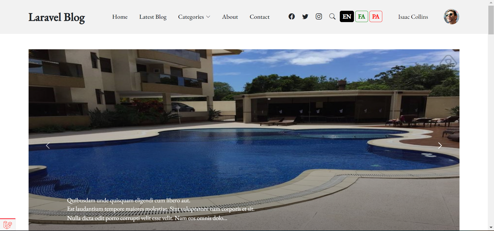

  <!--  -->
  

  <h1>Laravel Blog Project</h1>
  
  

    Final Project of Class 7th-June-2022 -- 4:45-5:45 PM
  

   

 

<!-- Table of Contents -->

# :notebook_with_decorative_cover: Table of Contents

-   [Course Syllabus](#star2-about-the-project)
    -   [Template Customization](#camera-screenshots)
    -   [Models](#space_invader-tech-stack)
    -   [Migrations](#dart-features)
    -   [Mass assignment](#art-color-reference)
    -   [CSRF Protection](#key-environment-variables)
    -   [HTTP Verbs](#key-environment-variables)
    -   [Creating Record](#key-environment-variables)
    -   [Updating Record](#key-environment-variables)
    -   [Deleting Record](#key-environment-variables)
    -   [Flash Messages](#key-environment-variables)
    -   [Route Model Binding](#key-environment-variables)
    -   [Middleware](#key-environment-variables)
    -   [Gate](#key-environment-variables)
    -   [Policy](#key-environment-variables)
    -   [Security](#key-environment-variables)
    -   [Authentication & Authorization](#key-environment-variables)
    -   [Multi Users with roles](#key-environment-variables)
    -   [Lazy Loading](#key-environment-variables)
    -   [Eager Loading](#key-environment-variables)
    -   [File Upload](#key-environment-variables)
    -   [Soft Delete](#key-environment-variables)
    -   [Eloquent Model Factories](#key-environment-variables)
    -   [Eloquent Model Seeder](#key-environment-variables)
    -   [Slug](#key-environment-variables)
    -   [Localization](#key-environment-variables)
    -   [Pagination](#key-environment-variables)
    -   [Filtering Records](#key-environment-variables)
    -   [Search](#key-environment-variables)
    -   [Notification with Laravel](#key-environment-variables)
    -   [Hashing](#key-environment-variables)
    -   [Deep dive into Relationships](#key-environment-variables)
    -   [One to One Relationship](#key-environment-variables)
    -   [One to Many Relationship](#key-environment-variables)
    -   [Many to Many Relationship](#key-environment-variables)
    -   [Inverse Relationships](#key-environment-variables)
    -   [Using Some external libraries](#key-environment-variables)
    -   [Working with APIs](#key-environment-variables)
    -   [Working with Postman](#key-environment-variables)
    -   [...](#key-environment-variables)
    <!-- About the Project -->

## :star2: About the Project

<!-- Screenshots -->

### :camera: Screenshots

 
  

 
  

 
  

<!-- FAQ -->

## :grey_question:

-   Practical Course with some theory so you get more experience that its essential for becoming a Professional Laravel Developer.
